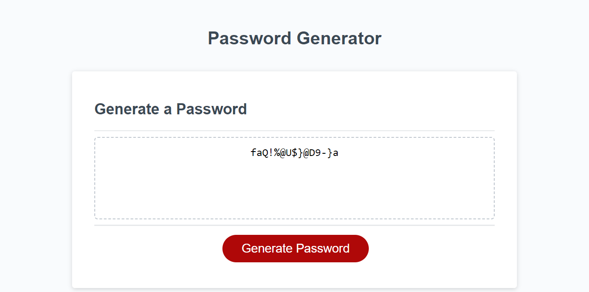

# Javascript : Random Password Generator
Password generator created using Javascript.

## Project Description

The purpose of this project is to allow user to generate a random password based on their preferences for length of password and characters types required.
The character type option includes lowercase letters, uppercase letters, numeric character and special charaters.

### Acceptance Criteria

```
On clicking Generate Password button, it would present a series of prompts for password criteria
Length of password, if length is not between 10 and 64, would prompt user to re enter password in the length specified.

Next, prompt user to confirm on Character types: Lowercase, Uppercase, Numeric, Special Characters.
if none selected, prompt user that at least one character type need to be selected.

Once prompts are validated then generated password is written on the page.

```

### Submission
Deployed Link :
https://yogi-88.github.io/password-generator/

### Technologies used

HTML, CSS, Javascript

### Screenshots
Screenshare of Password generator




